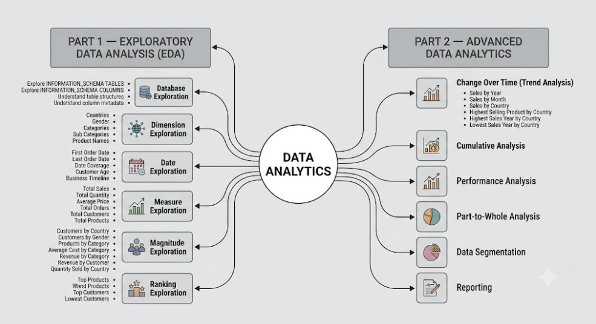

# SQL Data Analytics Project

## Project Overview
Brief description of what the project does.

## Objectives
- Extract raw data
- Clean and transform data
- Build the required architecture
- Implement core functionality
- Generate insights/results

## Tech Stack
- SQL Server
- GitHub
- Google Gemini (Project Approach Diagram)

## Architecture

Note: The project approach diagram was generated with Google Gemini AI and is included for documentation purposes.
